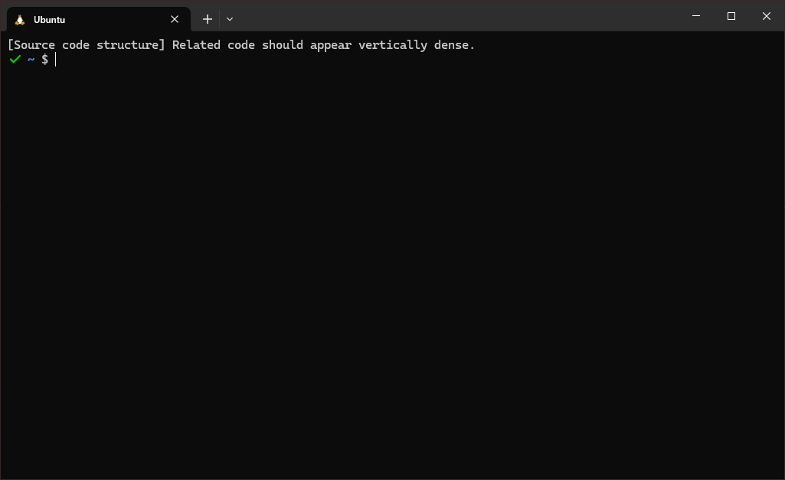

# Print random concept from Clean Code by Robert C. Martin

Recommended use: print a random phrase when you open a new terminal session.

To do this, run `bash install_bash.sh` to append the command to your bashrc.

To remove, open `~/.bashrc` and remove the line referencing `random_phrase.py`.

## Requirements

- Python3 (anything newer than 3.7 should be just fine)

# Credits

Concept list from @wojteklu 's wonderful [Summary of 'Clean code' by Robert C. Martin](https://gist.github.com/wojteklu/73c6914cc446146b8b533c0988cf8d29).
